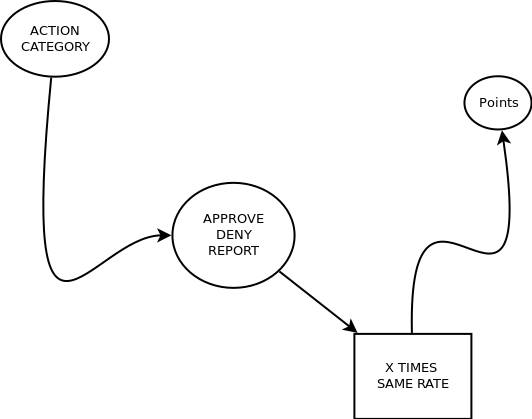

# World-Cleaner

### World-cleaner is the name of Our World Wide Brands Competition [Challenge](https://wiki.odicforcesounds.com/docs/en/Tao/Fragments/Path/)! 

### What is the Value of Choice?
- [Numeric Expressions that Represent Value](https://wiki.odicforcesounds.com/docs/en/Tao/Fragments/OdicPoints/)! 

#### Registered by Condition. Supported by:
- Values can only  [increment](https://wiki.odicforcesounds.com/docs/plan/psudoCode.html). 
- All negative expressions are part of a single fail. +0 ( ZERO ) 
- Therefor [we create solutions](https://wiki.odicforcesounds.com/docs/plan/Questions.html) to Question the Limits of a transparent [Good Business](https://pt.linkedin.com/in/rakzhodekams).

#### As You may Wish to participate or not:
- You are Included in [Our Eternal License](https://wiki.odicforcesounds.com/art/pages/License/index.html)

#### Project Tree code src/:
- Folder [components](./src/companies): control web interface components
- Folder [companies](./src/companies): control companies registration data
- Folder [system](./src/system): system control
- Folder [users](./src/users): control user data
- Folder [api](./src/api): control Firebase api calls

#### Projects diagrams/:

- Application Features

#### Code Principles
1. npm install 
2. tsc -w src/ 
- Participate: clone and make a pull request. 
- We have a [Slack](odicforcesoundsgroup.slack.com) Chat

